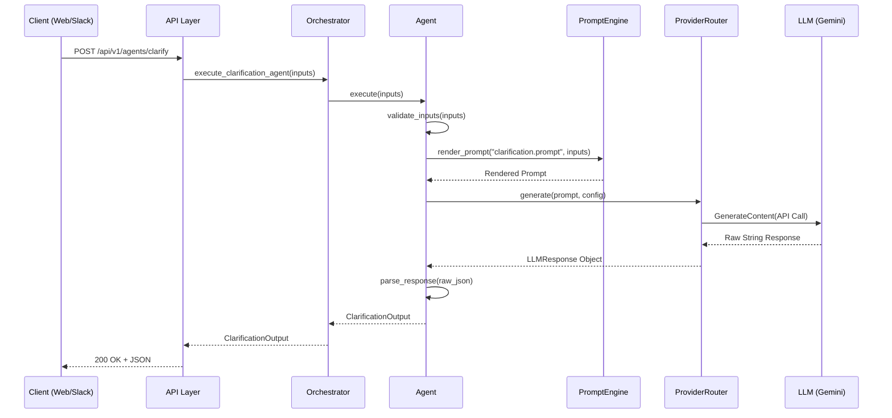

# Intelligence Service - Technical Reference

This document provides a comprehensive technical overview of the Intelligence Service module. It runs as a **FastAPI** application designed to provide LLM-powered conversational reasoning and agentic workflows.

---

## 1. System Architecture

The service is layered to separate concerns:

```mermaid
graph TD
    Client[External Client / Kafka] --> API[API Layer]
    API --> Orchestrator[Orchestration Layer]
    Orchestrator --> Agents[Agent Layer]
    Agents --> Loaders[Configuration Loaders]
    Agents --> Providers[Provider Router]
    Providers --> LLM[External LLMs (Gemini, etc.)]
    
    subgraph Core Components
    API
    Orchestrator
    Agents
    end
    
    subgraph Infrastructure
    Loaders
    Providers
    PromptEngine
    Observability
    end
```

---

## 2. Module Details

### 2.1 Core Orchestration (`app/orchestration/`)

#### `AgentOrchestrator` Class
The central hub for all agent executions. It maintains instances of all registered agents and provides high-level methods to execute them.

- **Attributes**:
    - `clarification_agent`: Instance of `ClarificationAgent`.
    - `prd_generator_agent`: Instance of `PRDGeneratorAgent`.
    - `analysis_agent`: Instance of `AnalysisAgent`.
- **Key Methods**:
    - `execute_full_workflow(user_description, project_context)`: 
        1. Calls `ClarificationAgent`.
        2. Passes answers to `PRDGeneratorAgent`.
        3. Passes resulting PRD to `AnalysisAgent`.
        4. Aggregates and returns the full result set.

### 2.2 Agent Framework (`app/agents/`)

#### `BaseAgent` (Abstract)
Defines the contract for all agents. 
- **Life Cycle**: `validate_inputs()` → `render_prompt()` → `call_llm()` → `parse_response()`.
- **YAML Linkage**: 
    - `super().__init__("agent-name")` tells the `BaseAgent` to load `agent-name.yaml`.
    - YAML defines the `prompt_template`, `routing` (provider/model), and `inputs/outputs` schema.

#### Implementations:
| Agent | Role | Input Schema | Output Schema |
|-------|------|--------------|---------------|
| `ClarificationAgent` | Asks probing questions | `ClarificationInput` | `ClarificationOutput` |
| `PRDGeneratorAgent` | Full Doc Generation | `PRDGeneratorInput` | `PRDGeneratorOutput` |
| `AnalysisAgent` | Risk/Gap Analysis | `AnalysisInput` | `AnalysisOutput` |

### 2.3 LLM Providers (`app/providers/`)

#### `ProviderRouter`
Manages provider lifecycles and provides high-level generation methods.
- **Failover Logic**: Sequentially tries `primary_provider` then `fallback_providers`.
- **Metrics**: Tracks token usage and cost for every call via `track_llm_call` decorator.

#### `GeminiProvider`
Implementation for Google's Gemini models. Handles API authentication, message formatting, and response parsing.

### 2.4 Prompt Engineering (`app/prompt_engine/`)

#### `TemplateRenderer`
Wraps **Jinja2** to render complex prompts.
- **Safety**: Includes `validate_template()` to check syntax before execution.
- **Introspection**: `get_template_variables()` can extract required fields from a template string.

### 2.5 Observability (`app/observability/`)

#### Logging (`logging.py`)
- **Structured Logging**: Uses `structlog` to output JSON format (optimized for ELK/Datadog).
- **Processors**: Adds timestamp, log level, and caller info to every log line.

#### Metrics (`metrics.py`)
Exposes **Prometheus** metrics:
- `intelligence_requests_total`: Request count by endpoint and status.
- `intelligence_llm_tokens_total`: Token consumption by provider/model.
- `intelligence_llm_cost_total`: Estimated API cost.
- `intelligence_kafka_messages_processed_total`: Kafka throughput tracking.

---

## 3. Data Flow & Schemas

### 3.1 Request Lifecycle (Sequence Diagram)



### 3.2 Key schemas (`app/schemas/agent_schemas.py`)
- `ClarificationOutput`: Contains `List[ClarificationQuestion]`, `rationale`, and `estimated_confidence`.
- `PRDGeneratorOutput`: Contains `prd` (Dict), `completeness_score`, and `estimated_effort`.

---

## 4. Domain & Persistence (`app/domain/`, `app/infrastructure/`)

The service maintains state for long-running workflows:
- **Models**: `Requirement`, `AgentResult`.
- **Repositories**: `ConversationRepository` manages the lifecycle of a thread.
- **Database**: Uses **SQLAlchemy (Async)** with a connection pool initialized in `main.py`.

---

## 5. Deployment & Configuration

### Environment Variables
- `DATABASE_URL`: PostgreSQL connection string.
- `KAFKA_BROKERS`: List of Kafka nodes.
- `GEMINI_API_KEY`: API key for Google AI Studio.
- `LOG_LEVEL`: defaults to `INFO`.

### Docker Setup
The root contains a **Dockerfile** and **docker-compose.yml** for local development, which spins up:
- The Intelligence Service.
- PostgreSQL.
- Kafka & Zookeeper.
- Prometheus for monitoring.
